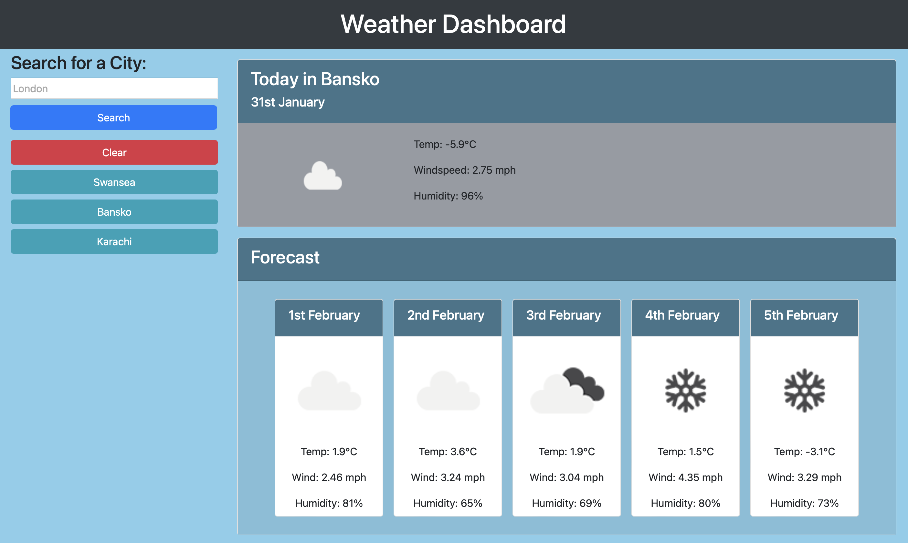

# Weather-Dashboard

## Description 
This site used the OpenWeatherAPI to fetch current weather and a five day forecast for a searched location. Used can search by city and the search history is saved and persisted using local storage. 

## RESTful APIs
This week we focused on using API's to fetch data from third party providers to use in our site. I have done this on this site using jQuery's AJAX function and a promise function to use the data when a response is received. Using OpenWeather's forecast API allows me to display current weather and a five day forecast on the page.

```javascript
    $.ajax({
    url: queryURLCurrent + savedCity + apiKey,
    method: "GET",
  }).then(function (response) {
    renderCurrentWeather(response);
    renderWeatherForecast(response);
  });
```

## Switch Case
I also wanted to implement some extra functionality in the site and change the background color of the current weather card dependning on the weather conditions. To do this I have implemented a switch statement and made a case for each category of conditions the API response can contain.

```javascript
    switch (conditionMain) {
        case "Thunderstorm":
            currentCardBody.css("background-color", "#4e5561");
            break;
```

## Deployed Site
[Weather Dashboard](https://roberttaylor94.github.io/Weather-Dashboard/)


